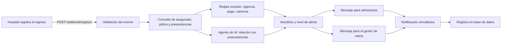

# Vigilia

**Sistema de alerta temprana de ingresos a emergencias.**
Solución al Reto 4 del hackIAthon de Viamatica y ADEN.

- **Agente en línea:** `<ENLACE PÚBLICO DEL DESPLIEGUE>`
- **Documentación interactiva de la API:** `<ENLACE PÚBLICO>/docs`

---

## Contexto del reto

El reto pide un webhook que se active cuando un asegurado ingresa a la emergencia de un hospital. Un agente debe revisar de inmediato la validez de la póliza y el historial de preexistencias, y notificar de forma simultánea al departamento de admisiones del hospital y al gestor de casos del seguro.

## El problema

Hoy, cuando un asegurado llega a emergencias, ninguna de las dos partes tiene la información completa a tiempo:

- El **hospital** no sabe con certeza si la póliza está vigente, al día o en período de carencia.
- El **seguro** ni siquiera se entera de que su asegurado fue ingresado.
- La relación entre el motivo de ingreso y una condición preexistente se descubre tarde, y termina en demoras administrativas y disputas de cobertura.

## La solución

Vigilia convierte el ingreso en un evento que dispara todo el proceso de forma automática:

1. El hospital envía el ingreso al webhook.
2. Vigilia valida la póliza con **reglas exactas**: vigencia, estado de pago y período de carencia.
3. Un **agente de inteligencia artificial** (Claude) interpreta el motivo de ingreso y determina si se relaciona con alguna preexistencia del historial.
4. Se emite un veredicto con su nivel de alerta.
5. Se redacta un mensaje distinto para cada destinatario y ambos se envían **en paralelo**: admisiones del hospital y gestor de casos del seguro.
6. Todo queda registrado para auditoría.

**Principio de diseño:** lo exacto lo decide el código (fechas, pagos, carencias) y la inteligencia artificial interpreta solo lo ambiguo (por ejemplo, si «dolor torácico» guarda relación con «hipertensión arterial»). Así el resultado es confiable, explicable y auditable.

> La validación es **administrativa**: en emergencias el paciente se atiende siempre. La alerta informa; no condiciona la atención.

## Cómo funciona



### Veredictos

| Veredicto | Significado |
|---|---|
| `VALIDA` | Póliza vigente, al día y sin alertas. |
| `VALIDA_CON_ALERTAS` | Póliza vigente, pero con carencia, pago atrasado o preexistencia relacionada. |
| `NO_VALIDA` | Póliza vencida. |
| `NO_ENCONTRADO` | No existe el asegurado o no tiene póliza. |

Nivel de alerta: `BAJO`, `MEDIO` o `ALTO`.

## Ejemplo

**Entrada**

```bash
curl -X POST "$URL/webhook/ingreso" -H "Content-Type: application/json" -d '{
  "evento_id": "ING-0001",
  "cedula": "8-400-400",
  "hospital": "Hospital Punta Pacífica",
  "motivo_ingreso": "Dolor torácico opresivo",
  "triage": 2,
  "fecha_ingreso": "2026-09-24T14:32:00-05:00"
}'
```

**Salida (resumen)**

```json
{
  "evento_id": "ING-0001",
  "veredicto": "VALIDA_CON_ALERTAS",
  "nivel_alerta": "ALTO",
  "preexistencias": [
    { "condicion": "Hipertensión arterial", "relacion": "DIRECTA", "justificacion": "..." }
  ],
  "mensaje_admisiones": "...",
  "mensaje_gestor": "...",
  "notificaciones": [
    { "destino": "admisiones", "canal": "slack", "estado": "ENVIADA" },
    { "destino": "gestor_casos", "canal": "slack", "estado": "ENVIADA" }
  ]
}
```

El contrato completo de datos y los casos de prueba están en [`backend/docs/contratos.md`](backend/docs/contratos.md).

## Tecnologías

| Componente | Herramienta | Función |
|---|---|---|
| Servidor | Python y FastAPI | Recibe el webhook y orquesta el flujo. |
| Validación | Pydantic | Define y valida el contrato de datos. |
| Base de datos | SQLite | Asegurados, pólizas, preexistencias, ingresos y notificaciones. |
| Agente | API de Claude (Anthropic) | Relaciona el motivo de ingreso con las preexistencias y redacta los mensajes. |
| Notificaciones | Webhooks de Slack, `asyncio` y `httpx` | Envío simultáneo a admisiones y gestor de casos. |
| Pruebas | pytest | Verifica el veredicto de cada caso de prueba. |

## Ejecutar en local

Requisitos: Python 3.11 o superior.

```bash
cd backend
python -m venv .venv && source .venv/bin/activate
pip install -r requirements.txt
cp .env.example .env          # completar las variables de entorno
uvicorn app.main:app --reload
```

La documentación interactiva queda disponible en `http://localhost:8000/docs`.

### Variables de entorno

| Variable | Uso |
|---|---|
| `ANTHROPIC_API_KEY` | Acceso a la API de Claude. |
| `SLACK_WEBHOOK_ADMISIONES` | Canal de notificación de admisiones. |
| `SLACK_WEBHOOK_GESTOR` | Canal de notificación del gestor de casos. |
| `VIGILIA_DB` | Ruta del archivo SQLite (opcional). |

Si no se definen las variables de Slack, las notificaciones se simulan por consola.

### Pruebas

```bash
cd backend
pytest
```

## Despliegue

Comando de inicio: `uvicorn app.main:app --host 0.0.0.0 --port $PORT`, con `backend` como directorio raíz del servicio y las variables de entorno configuradas en la plataforma. La base de datos se recrea con datos de prueba en cada arranque.

## Estructura del repositorio

```
.
├── README.md
└── backend/
    ├── app/
    │   ├── main.py        # rutas y orquestación del flujo
    │   ├── schemas.py     # contrato de datos
    │   ├── rules.py       # reglas exactas y decisión final
    │   ├── agent.py       # agente de IA
    │   ├── notifier.py    # notificaciones en paralelo
    │   ├── db.py          # conexión y tablas
    │   └── seed.py        # datos de prueba
    ├── docs/contratos.md
    ├── tests/
    └── requirements.txt
```

## Alcance y consideraciones

- Todos los datos de asegurados, pólizas y preexistencias son **ficticios**, generados para la demostración.
- Los canales de notificación son intercambiables: en un entorno real, admisiones se integraría con el sistema del hospital y el gestor de casos con el CRM de la aseguradora.
- Las claves y credenciales se gestionan únicamente mediante variables de entorno; nunca se incluyen en el repositorio.

## Equipo

Isaac Muñoz y Rubén Pino.
